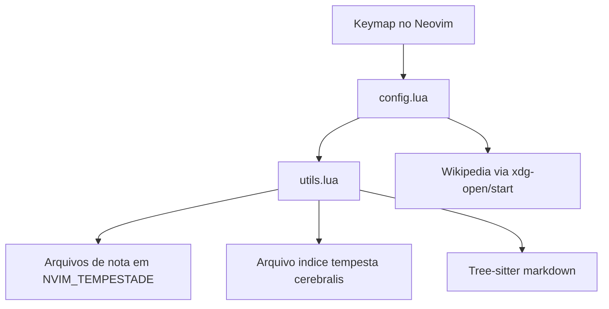

# Architecture

**Pattern:** plugin monolítico pequeno, organizado por módulo Lua, com lógica de domínio concentrada em um arquivo utilitário
**Analyzed:** 2026-04-10

## High-Level Structure

O repositório expõe um plugin de Neovim voltado a criação, abertura e conexão de notas em um diretório externo. A superfície pública é pequena: atalhos de teclado entram por `config.lua`, e praticamente todo o comportamento de notas, links e índice é executado por `utils.lua`.

## Identified Patterns

### Entrypoint Thin Wrapper

**Location:** `lua/zettelvim/init.lua`
**Purpose:** carregar a configuração pública do plugin
**Implementation:** o arquivo só executa `require('zettelvim.config')`
**Example:** `init.lua` delega totalmente o comportamento para `config.lua`

### Command and Keymap Layer

**Location:** `lua/zettelvim/config.lua`
**Purpose:** expor comandos acionados por usuário e registrar keymaps
**Implementation:** `NormalCall()`, `VisualCall()` e `searchWikipedia()` capturam contexto do buffer atual, delegam a utilitários e abrem o arquivo alvo
**Example:** `VisualCall()` salva o buffer, yanka a seleção em `a`, normaliza texto e chama `ZettelVimCreateorFind(selection)`

### Utility-Centric Domain Layer

**Location:** `lua/zettelvim/utils.lua`
**Purpose:** centralizar regras de negócio de notas, links, índice e filetype
**Implementation:** um módulo `M` expõe poucas funções públicas, enquanto o restante é implementado por funções locais auxiliares
**Example:** `ZettelVimCreateorFind()`, `ZettelVimNovaNota()` e `get_tempestade_path()`

### File-Backed Note Model

**Location:** `lua/zettelvim/utils.lua`
**Purpose:** tratar cada nota como um arquivo independente no vault
**Implementation:** o título da nota vira nome de arquivo; a nota contém cabeçalho markdown e blocos fenced para links/ranking
**Example:** criação de nota com `vim.fn.writefile({titulo, '', link_line_head, link_line_tail, ''}, nota_alvo_path)`

### Syntax-Aware Metadata Extraction

**Location:** `lua/zettelvim/utils.lua`
**Purpose:** localizar blocos `links` e `ranking` sem depender apenas de busca textual linear
**Implementation:** Tree-sitter parseia markdown, e funções recursivas percorrem nós até encontrar `fenced_code_block`
**Example:** `encontra_bloco_de_links_recursivamente()` e `encontra_bloco_de_ranking_recursivamente()`

### Legacy Serialization Side Path

**Location:** `lua/zettelvim/Notas.lua`, `NovaNota.lua`, `Serialize.lua`, `SerializeMarkdown.lua`
**Purpose:** representar notas como tabelas Lua e serializá-las para arquivos
**Implementation:** módulos antigos usam globais e serialização manual para `.lua` e `.md`
**Example:** `SerializeWithVarName()` grava uma tabela Lua em disco; `NovaNota()` cria uma nota serializada

## Data Flow

### Fluxo: abrir ou criar nota a partir do buffer atual

1. Usuário aciona `<leader>qf` ou `qf`
2. `config.lua` coleta o alvo do cursor ou da seleção
3. `config.lua` chama `ZettelVimCreateorFind(nota_alvo)`
4. `utils.lua` garante que a nota exista no vault
5. `utils.lua` identifica a nota fonte via `vim.fn.expand("%:t")`
6. `utils.lua` adiciona links entre fonte e alvo
7. `utils.lua` incrementa o ranking no índice `tempesta cerebralis`
8. `config.lua` abre `tempestade_path .. nota_alvo`

### Fluxo: ajustar filetype de notas sem extensão

1. `utils.lua` registra um `autocmd` para `BufRead` e `BufNewFile`
2. `setMarkdonwFileType()` lê o caminho completo do buffer atual
3. Se o caminho começa com `tempestade_path`, define `vim.bo.filetype = "markdown"`
4. O buffer passa a ser tratado como markdown pelo restante do editor e pelo Tree-sitter

### Fluxo: manutenção de ranking no índice

1. `add_link_em_indice()` abre o arquivo índice
2. Lê o bloco `ranking` e reidrata um mapa `{link -> count}`
3. Incrementa a contagem da nota alvo
4. Reescreve o bloco ordenado por contagem decrescente

## Code Organization

**Approach:** organização modular mínima, com separação por tipo de responsabilidade, mas sem camadas rígidas

**Structure:**

- `lua/zettelvim/init.lua`: bootstrap do plugin
- `lua/zettelvim/config.lua`: interface com usuário e atalhos
- `lua/zettelvim/utils.lua`: regras de negócio e integração com Neovim
- `lua/zettelvim/*.lua` restantes: módulos legados de serialização e estrutura de notas
- `lua/zettelvim/testes/`: scripts manuais de experimento

**Module boundaries:**

- `config.lua` depende de `utils.lua`
- `utils.lua` depende diretamente de `vim`, Tree-sitter, ambiente e filesystem
- módulos legados não estão claramente integrados ao fluxo principal de keymaps

## Architectural Risks

- Grande concentração de responsabilidades em `utils.lua`
- Dependência forte de estado implícito do buffer atual
- Escrita direta em arquivos sem camada intermediária de validação
- Testabilidade baixa, porque o domínio está fortemente acoplado ao runtime do Neovim
